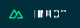

<h3 style="font-size:1.15em;margin-top:0;">
    <a 
        href="https://www.gregjacobs.com" 
        title="GregJacobs.com" 
        alt="GregJacobs.com"
        target="_blank"
        rel="nofollow"
        >
            GregJacobs.com
    </a>
</h3>

    
    <h1 align="left">UI/UX Designer &amp; Front End Developer</h1>

I develop user interfaces and user experiences for websites and web applications... and I love it 🙂

I'm a seasoned UI/UX Designer and Frontend Developer with a passion for crafting intuitive digital experiences. With a proven track record spanning since I built my first computer in 1996, I have collaborated on a myriad of projects, seamlessly fusing creativity and functionality to bring designs to life.

My journey has equipped me with a deep understanding of user-centered design principles, enabling me to bridge the gap between aesthetics and seamless functionality. Join me as I continue to shape pixels and code, harmonizing innovation and user satisfaction to create digital landscapes that captivate and engage.

<!-- 
Greg, you downloaded all external badges and saved them in the ./badges folder. Leaving code here for reference.
// URL: https://shields.io
// GITHUB: https://github.com/badges/shields

-->

<h4>My Online Presence:</h4>

<!-- NOTE: Github strips style and other styling attributes, like "fill" on SVG <path> elements. It will even strip this comment ;) @Greg -->

  

